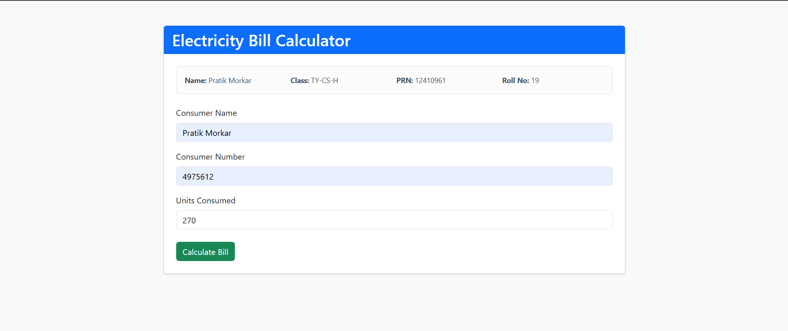
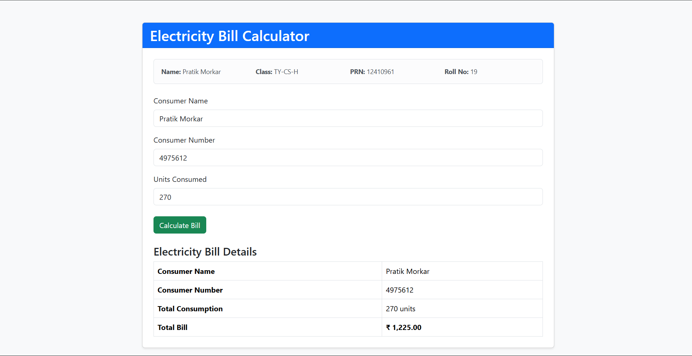

# Electricity Bill Calculator (PHP)

A responsive PHP application that calculates electricity bills using slab-wise tariff rates.

## Features

- Consumer name, number, and units input
- Server-side PHP validation and bill calculation
- Responsive Bootstrap interface
- jQuery client-side validation
- Clear consumption and bill result display

## Tech Stack

- PHP
- Bootstrap 5.3.3
- jQuery 3.7.1

## Project Structure

```text
index.php                 Main page and request handling
includes/functions.php    Validation and bill calculation
includes/header.php       Shared page header and student details
includes/footer.php       Shared scripts and page footer
```

## Calculation Logic

| Units consumed  |              Rate |
| --------------- | ----------------: |
| First 50 units  | Rs. 3.50 per unit |
| Next 100 units  | Rs. 4.00 per unit |
| Next 100 units  | Rs. 5.20 per unit |
| Above 250 units | Rs. 6.50 per unit |

Each tariff is applied to the units in its respective slab.

## How to Use

1. Start a PHP server in this folder.
2. Open `index.php` in a browser.
3. Enter the consumer details and units consumed.
4. Click **Calculate Bill**.

## Screenshots

Add the working application screenshots here:




