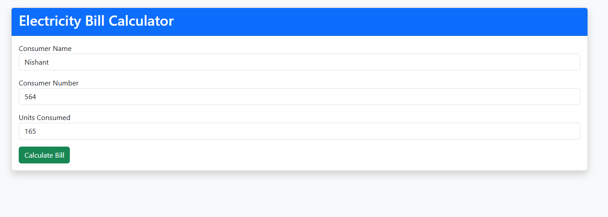
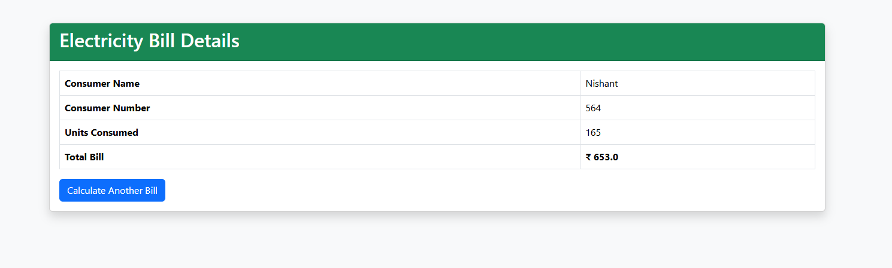

# Electricity Bill Calculator

A Java Servlet and JSP application that calculates electricity bills using slab-wise rates.

## Features

- Consumer bill calculation
- Slab-based tariff rates
- Client-side validation
- Server-side processing with a Servlet
- Bill result page with consumer details

## Tech Stack

- Java 17+
- Java Servlets and JSP
- Apache Tomcat 9
- Bootstrap 5.3.3
- jQuery 3.7.1

## How to Use

1. Enter the consumer name, consumer number, and units consumed.
2. Click **Calculate Bill**.
3. View the consumer details and calculated bill on the result page.

## Calculation Logic

| Units consumed  |              Rate |
| --------------- | ----------------: |
| First 50 units  | Rs. 3.50 per unit |
| Next 100 units  | Rs. 4.00 per unit |
| Next 100 units  | Rs. 5.20 per unit |
| Above 250 units | Rs. 6.50 per unit |

The bill is calculated by applying each rate to the units in its respective slab.

## Screenshots





## Run

Deploy the project on Apache Tomcat 9 and open:

```text
http://localhost:8080/Electricity/index.jsp
```
