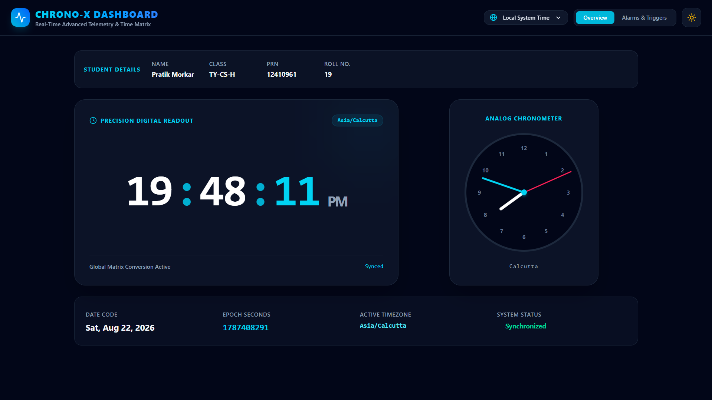
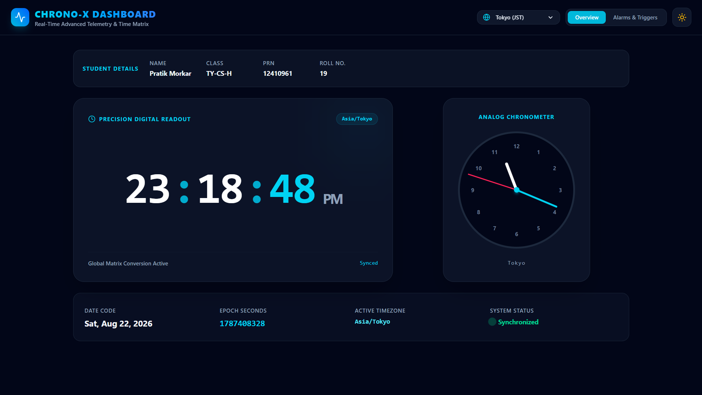

# Real-Time Clock Dashboard

A React dashboard for viewing time in different time zones.

## Features

- Live digital and analog clocks
- Local, UTC, Tokyo, and other time zones
- Light and dark themes
- Alarm creation and notifications
- Student details display

## Screenshots

### Local Time



### Tokyo Time



## Run the Project

```bash
npm install
npm run dev
```
