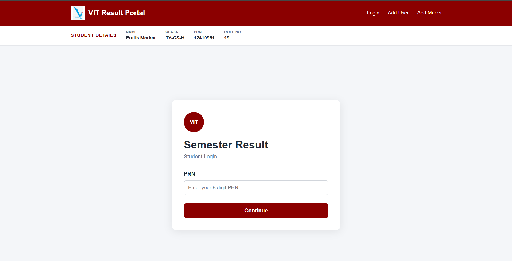
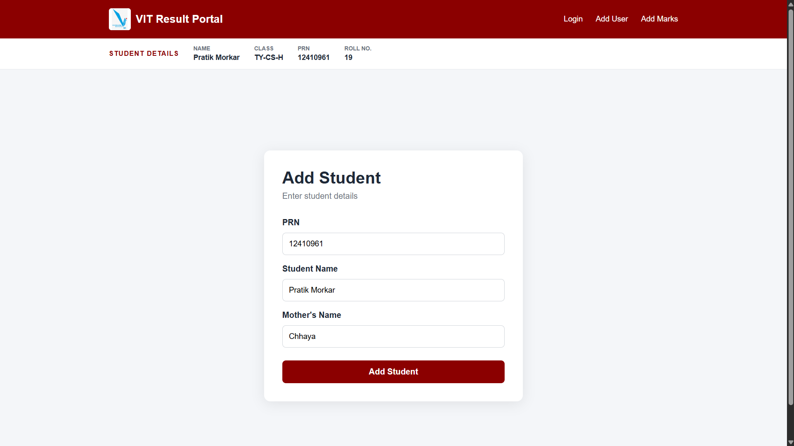
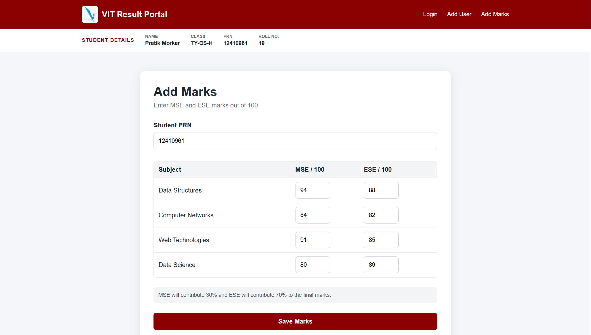
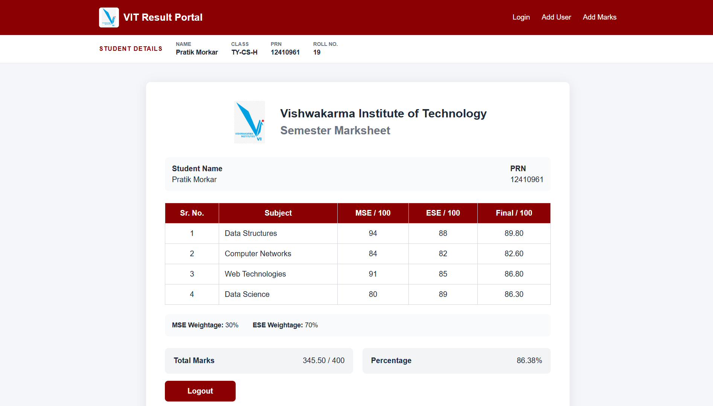

# VIT Result Portal

A React portal for managing and viewing semester results.

## Features

- Student registration and login with PRN
- Identity verification
- MSE and ESE marks entry
- Automatic marksheet calculation
- Student details display

## Screenshots









## Run the Project

```bash
npm install
npm run dev
```
